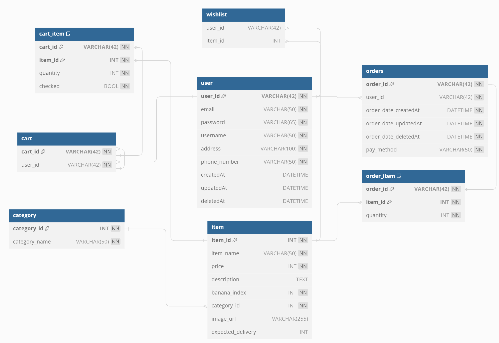

# 저탄소에 반한 바나나

### 서비스 소개

**바나나 인덱스**는 기후 영향과 영양가가 중간 정도인 **바나나를 기준으로 식품별 탄소 배출량을 정리한 지표**입니다. 

본 프로젝트는 **바나나 인덱스를 활용한 쇼핑몰 서비스**로, 소비자가 쉽게 저탄소 식품을 선택할 수 있는 구매 환경을 마련하고자 합니다.

 

#### 프로젝트 기대 효과

- 명료하고 이해하기 쉬운 바나나 인덱스로 탄소 배출량을 손쉽게 비교 가능

- 구매 전과정에서 바나나 인덱스 지표를 제공해 탄소 배출량이 적은 식품 선택 유도

- 구매 목록에 따른 개인화 차트로 지속적인 저탄소 식습관 형성

 

프로젝트 기간 : 2023-11-20 ~ 2023-12/09

---

#### 데이터셋

- Banana Index : https://www.kaggle.com/datasets/joebeachcapital/banana-index

- 탄소 소비량 추가자료 : https://www.kaggle.com/code/sasakitetsuya/co2-emission-gap-among-countries-clustering-pca/input

## 프로젝트 구성

### 기술 스택

1.  **프론트엔드**  
     

     

2.  **백엔드**  
      
     
    DB 
      

 

3.  **데이터 분석** 

### 주요 기능 소개

#### 메인 페이지

- 그래프
- 추천 상품 (바나나 인덱스가 1이하인 상품 랜덤 조회)

#### 유저 로그인

- 회원가입 / 이메일 중복 확인
- 로그인 (액세스 토큰, 리프레시 토큰 발급)
- 로그아웃 (토큰 파기)

#### 상품 조회 페이지

- 상품 상세 페이지
- 검색 기능
- 카테고리 별 조회
- 페이지네이션/인피니티 스크롤

#### 장바구니

- 장바구니 담기
- 장바구니 조회 및 수정

#### 주문

- 주문 목록 생성
- 주문 목록 전체 조회 및 상세 조회

#### 찜하기

- 찜하기 및 찜하기 취소
- 찜한 목록 조회

#### 마이 페이지

- 자신의 탄소 소비 지표 그래프
- 최대, 최소, 평균 조회

## 팀원 역할 분담

|  이름  | 담당 업무                                      |
| :----: | :--------------------------------------------- |
| 허제인 | 팀장 / 프론트                                  |
| 정아영 | 프론트                                         |
| 박수진 | 백엔드팀장 : 유저/로그인, 찜 목록 / 데이터분석 |
| 장재웅 | 백엔드 : 장바구니, 검색 및 자동완성            |
| 조영민 | 백엔드 : 주문 내역, Pagination                 |

#### 담당한 부분

- User, Wishlist API
- 상품 랜덤 조회, 그래프 관련 조회 API
- 로그인 관련 기능(리프레시 토큰)
- pandas를 이용한 데이터 정제

## ERD 다이어그램

